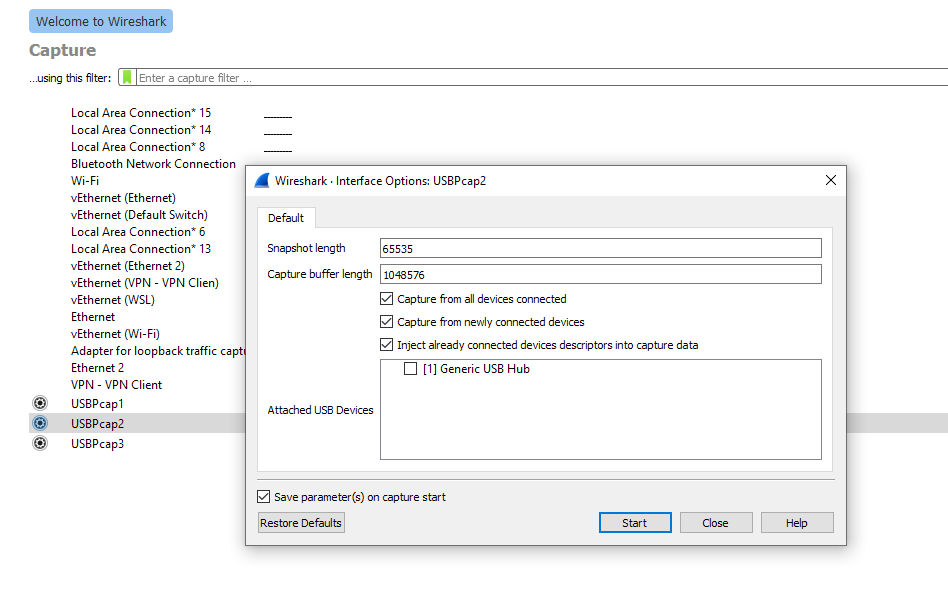
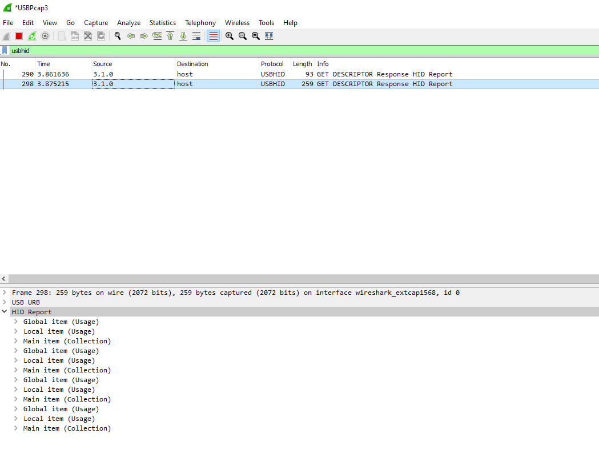
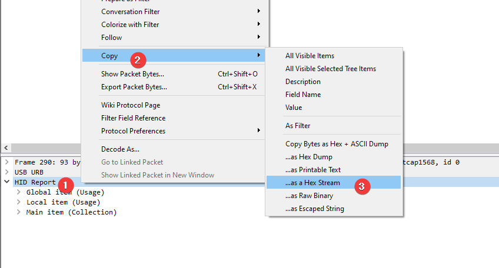
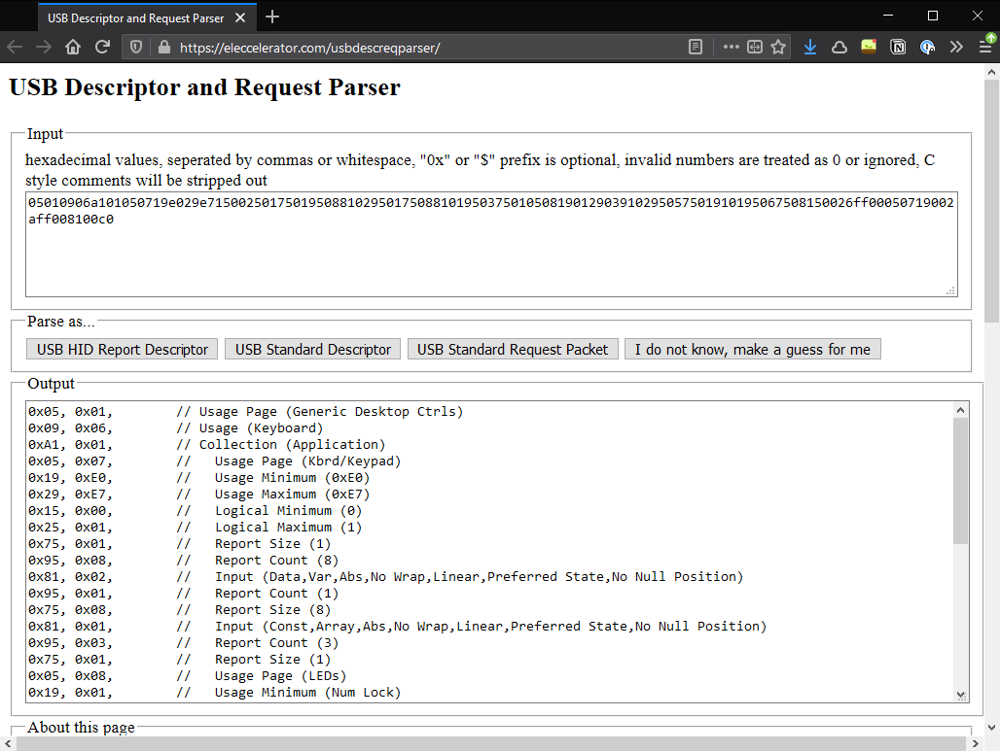
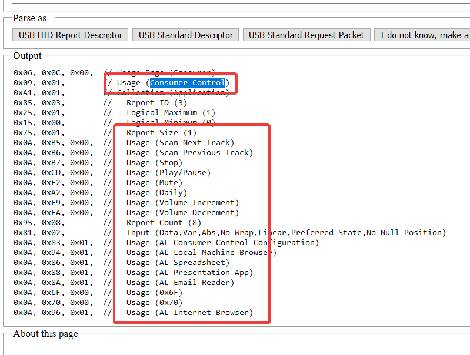
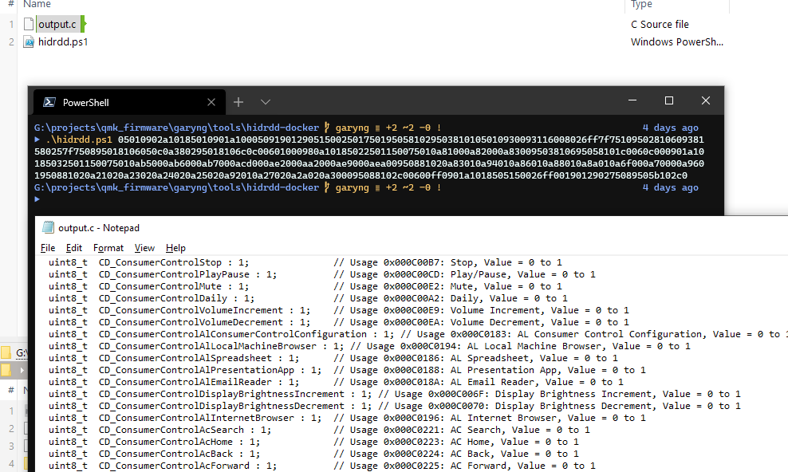

# `garyng/qmk_firmware`

My personal fork of [`qmk_firmware`](https://github.com/qmk/qmk_firmware) with some additional features.

> `master` is kept updated using [`wei/pull`](https://github.com/wei/pull).

## Additional Features

> Most of the features here are used with [`garyng/ahk-utilities`](https://github.com/garyng/ahk-utilities) and [Hasu USB-USB Converter](https://geekhack.org/index.php?topic=69169.0).

### HidGeneric

> [`HidGeneric.cpp`](https://github.com/garyng/qmk_firmware/blob/6a724277c0a98414949ef96405a133635ac50286/keyboards/converter/usb_usb/HidGeneric.cpp) [`HidGenericReportParser.cpp`](https://github.com/garyng/qmk_firmware/blob/6a724277c0a98414949ef96405a133635ac50286/keyboards/converter/usb_usb/HidGenericReportParser.cpp)

Extends [Hasu USB-USB Converter](https://geekhack.org/index.php?topic=69169.0)'s firmware to allow user to implement their own HID report parser ([guide](#implementing-a-custom-hid-report-parser)). This is used for recognizing media keys on keyboards since they are ignored by the original firmware of the converter.

> Thanks to [@fauxpark](https://github.com/fauxpark) on QMK Discord server and [hasu@tmk](https://github.com/tmk) for helping!

### Wrapping Key

> [`wrapping_key.c`](https://github.com/garyng/qmk_firmware/blob/6a724277c0a98414949ef96405a133635ac50286/keyboards/converter/usb_usb/keymaps/garyng/wrapping_key.c) 

A key that acts like a layer switching key, but instead of switching layers, it will switch the "wrapping key", `wk`. A wrapping key is a key that wraps all other keys. For example, if you pressed `kc`, it will wrap it and send `<wk down> <kc> <wk up>` instead.

### Tap Auto Mod

> [`tap_auto_mod.c`](https://github.com/garyng/qmk_firmware/blob/6a724277c0a98414949ef96405a133635ac50286/keyboards/converter/usb_usb/keymaps/garyng/tap_auto_mod.c)

This is a combination of QMK's [Tap Dance](https://beta.docs.qmk.fm/using-qmk/software-features/feature_tap_dance) and [Auto Shift](https://beta.docs.qmk.fm/using-qmk/software-features/feature_auto_shift) with a much simplified implementation.

Depends on the configuration, it will send different `<mod>` with the original `<kc>` based on how many times you tapped the key. For example, tap twice to send `Ctrl + <kc>` and tap thrice to send `Alt + <kc>`.

---

# Usage Guides

## Implementing a custom HID report parser

### Getting HID Report Descriptor with [Wireshark](https://www.wireshark.org/)

Launch Wireshark to capture USB data:

Unplug and plug your device > Filter by `usbhid` inside Wireshark:

> Note: If you can't see any packets, most likely you are listening on the wrong device.

Right click on the `HID Report` section > Copy > Copy as Hex Stream:

You can verify whether you copied the correct data with [USB Descriptor and Request Parser](https://eleccelerator.com/usbdescreqparser/) tool.
Paste the hex values into the tool > Click on "USB HID Report Descriptor":

If you are trying to implement a report parser for media keys, look for descriptor that has a `Usage` of `Consumer Control`.

### Converting HID Report Descriptor into C structs with [hidrdd](https://sourceforge.net/projects/hidrdd/)

Run [hidrdd.ps1](https://github.com/garyng/qmk_firmware/blob/6a724277c0a98414949ef96405a133635ac50286/garyng/tools/hidrdd-docker/hidrdd.ps1) with the hex stream as argument. The structs will be saved to `output.c`:

> Note: The script uses the dockerized version of the tool at [garyng/hidrdd-docker](https://github.com/garyng/hidrdd-docker)

### Implementing the report parser

Take a look at [`HidGenericReportParser.cpp`](https://github.com/garyng/qmk_firmware/blob/6a724277c0a98414949ef96405a133635ac50286/keyboards/converter/usb_usb/HidGenericReportParser.cpp). With the structs generated, you can easily parse the `*buff` passed into the `Parse` function of the parser. The example implementation just translates the flags to the corresponding `KC_` values and writes them back to `report_keyboard_t`.

### Mapping the keys

By default unrecognized keys are ignored by the USB-USB converter, you need to add them manually and modify your `keymap.c` layout file accordingly. See [40b16f7fca07](https://github.com/garyng/qmk_firmware/commit/40b16f7fca070b2ebec2e4590362ae21f34a9ae3) as an example.

## Using Wrapping Key

1. `#define MAX_WK` in `config.h` for the maximum number of wrapping keys used [(example)](https://github.com/garyng/qmk_firmware/blob/6a724277c0a98414949ef96405a133635ac50286/keyboards/converter/usb_usb/keymaps/garyng/config.h#L14)
1. Optionally create an `enum` to name each wrapping key index (`wki`) [(example)](https://github.com/garyng/qmk_firmware/blob/6a724277c0a98414949ef96405a133635ac50286/keyboards/converter/usb_usb/keymaps/garyng/keymap.c#L25-L31)
1. Populate `wki_to_wk` (maps index to the wrapping key) and `wki_to_kc` (maps wrapping key to the original key code) [(example)](https://github.com/garyng/qmk_firmware/blob/6a724277c0a98414949ef96405a133635ac50286/keyboards/converter/usb_usb/keymaps/garyng/keymap.c#L33-L47)
1. Wrap your `wki` with `WK` macro inside your layout [(example)](https://github.com/garyng/qmk_firmware/blob/6a724277c0a98414949ef96405a133635ac50286/keyboards/converter/usb_usb/keymaps/garyng/keymap.c#L98).
1. Call `process_wk_user` inside `process_record_user` [(example)](https://github.com/garyng/qmk_firmware/blob/6a724277c0a98414949ef96405a133635ac50286/keyboards/converter/usb_usb/keymaps/garyng/keymap.c#L134-L138).

## Using Tap Auto Mod

The default mod stack is:

| Taps | Mod  |
| ---- | ---- |
| 2    | Ctrl |
| 3    | Alt  |

1. `#define MAX_TAM_TAPS` in `config.h` for the maximum number of taps [(example)](https://github.com/garyng/qmk_firmware/blob/a962f8254e2761d7e408e2ecf85bf298972fcf1e/keyboards/converter/usb_usb/keymaps/garyng/config.h#L12)
   - You might need to change `TAPPING_TERM` as well if the default is too short
1. Define your own mod stack by populating `tam_mod_maps[MAX_TAM_TAPS + 1]` [(example)](https://github.com/garyng/qmk_firmware/blob/a962f8254e2761d7e408e2ecf85bf298972fcf1e/keyboards/converter/usb_usb/keymaps/garyng/keymap.c#L25-L28)
1. Call `matrix_scan_tam_user()` inside `matrix_scan_user` [(example)](https://github.com/garyng/qmk_firmware/blob/6a724277c0a98414949ef96405a133635ac50286/keyboards/converter/usb_usb/keymaps/garyng/keymap.c#L129-L131)

## Notes

Currently, wrapping key and tap auto mod are tightly coupled to each other.
